# 네모(Nemo) 매물 분석 리포트
## 데이터 기반 상업용 부동산 전략 가이드

  

    

      
🏢

      
INTEL LAB

    

  

  

    
V2.0 PRO

    
🎯 DATA: 677 SAMPLES

    
🛠 METHOD: EDA & REGRESSION

    
🚀 GOAL: MAX REVENUE

  

<!-- note
안녕하십니까. 지금부터 네모(Nemo) 플랫폼의 상가 및 사무실 매물 데이터를 분석한 2026년도 상반기 EDA 리포트 발표를 시작하겠습니다. 본 리포트는 단순한 시장 조사를 넘어, 실제 현장에서 수집된 677건의 방대한 마이크로 데이터를 기반으로 작성되었습니다. 오늘 발표의 핵심은 '데이터가 어떻게 부동산 거래의 불확실성을 제거하고, 수익으로 연결되는 의사결정을 돕는가'에 있습니다.

우리는 지난 수개월간 네모 플랫폼에 등록된 매물들의 가격, 위치, 업종, 그리고 임대인들이 작성한 텍스트 정보까지 모든 정형/비정형 데이터를 전수 분석했습니다. 특히 대한민국 부동산 시장의 바로미터라고 할 수 있는 강남권 중심의 데이터 밀집 현상을 집중적으로 파헤쳤습니다. 이번 발표를 통해 우리는 총 11개의 세부 분석 지표를 살펴볼 예정이며, 각 지표는 네모 플랫폼의 추천 알고리즘 고도화와 마케팅 전략 수립의 근거가 될 것입니다.

단순히 "이 지역이 비싸다"는 상식을 넘어, "왜 비싼지, 그리고 어떤 업종이 들어가야 그 비용을 정당화할 수 있는지"에 대한 답을 찾아보겠습니다. 부동산 데이터 사이언스 팀이 공들여 준비한 이번 분석 결과가 여러분의 비즈니스 인사이트 확장에 큰 도움이 되기를 바랍니다. 자, 그럼 본격적으로 데이터가 그리는 대한민국 상업용 부동산의 지도를 확인해보겠습니다.
-->

---

## 1. 분석 개요 및 데이터 설계

  

    

      

        
📊

        
INDEX

      

      

        
🎯

        
MATCH

      

    

  

  

    
OBJECTIVES

    <h3>데이터 거버넌스</h3>
    <ul style="font-weight: bold; line-height: 2;">
      <li>PRICE STANDARD 수립</li>
      <li>AREA ANALYSIS 데이터화</li>
      <li>SEO LOGIC 분석</li>
    </ul>
  

<!-- note
첫 번째 슬라이드에서는 이번 분석의 설계 배경과 데이터 거버넌스에 대해 말씀드리겠습니다. 상업용 부동산 시장은 아파트와 같은 주거용 부동산에 비해 정보의 비대칭성이 매우 심각한 분야입니다. '부르는 게 값'이라는 인식이 강한 이 시장에서, 네모는 데이터라는 무기로 투명성을 확보하고자 합니다.

우리는 이번 프로젝트를 위해 세 가지 핵심 목표를 설정했습니다. 
첫째, 입지별 평당 임대료를 표준화하는 것입니다. 강남역 도보 5분 거리의 1층 상가라면 최소한 어느 정도의 가격이 '적정가'인지에 대한 기준을 데이터로 정립했습니다. 
둘째, 업종별 최적 면적 구간을 도출하는 것입니다. 카페 창업자가 100평짜리 매물을 보는 것과, 대형 병원이 20평짜리 매물을 보는 시행착오를 줄여주기 위함입니다. 
셋째, 비정형 데이터인 '매물 제목'을 텍스트 마이닝하여, 임차인의 클릭을 유도하는 심리적 트리거를 분석했습니다.

이러한 데이터 설계는 네모 플랫폼이 단순한 매물 게시판을 넘어, 임대인에게는 '최적 임대료 컨설턴트'가 되고 임차인에게는 '가성비 탐지기'가 되는 기술적 기반이 될 것입니다. 677건의 데이터는 단순히 숫자의 집합이 아니라, 현재 상업용 부동산 시장의 공급자와 수요자가 끊임없이 주고받는 신호(Signal)입니다. 우리는 이 슬라이드 이후부터 그 신호들이 의미하는 구체적인 비즈니스 가치를 하나씩 증명해 나갈 것입니다.
-->

---

## 2. 입지 및 업종 마켓 맵

  

    

      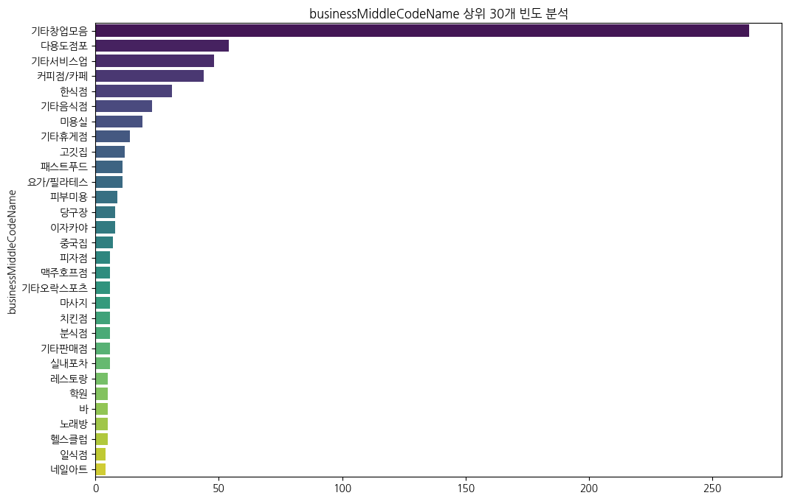
      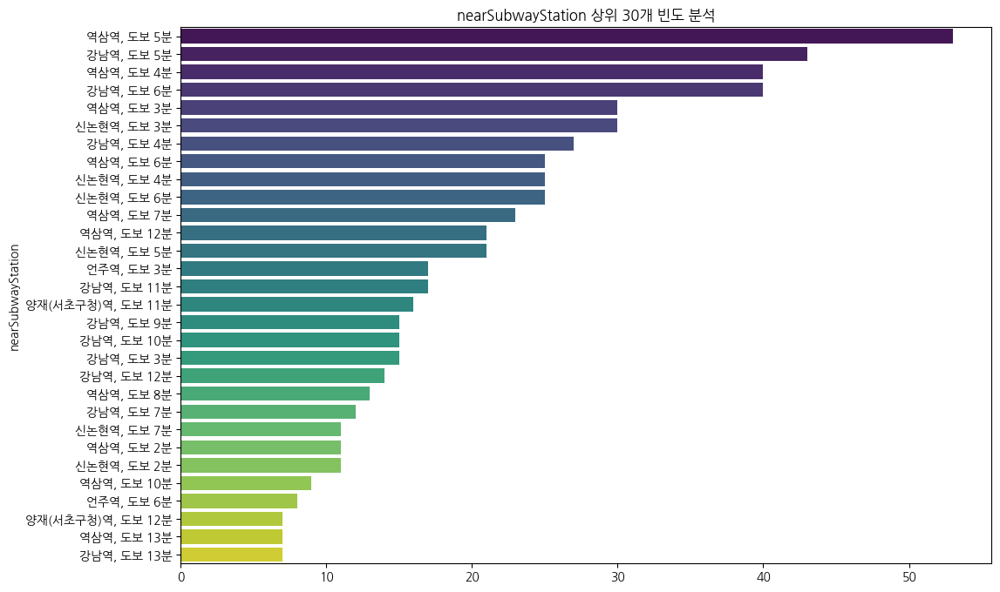
    

  

  

    
TOP: 기타판매(39%)

    
HOT: 강남/역삼/선릉

    
강남권 오피스 배후 수요 공급 밀집 현상 뚜렷

  

<!-- note
이번 슬라이드는 현재 우리 플랫폼에 등록된 매물들이 어디에, 그리고 어떤 모습으로 분포하고 있는지를 보여주는 '마켓 맵'입니다. 데이터 분석 결과, 매우 흥미로운 'T-라인 밀집 현상'이 포착되었습니다.

먼저 오른쪽의 역세권 분포를 봐주십시오. 역삼역, 강남역, 선릉역으로 이어지는 이른바 테헤란로 중심축의 매물 점유율이 압도적입니다. 이는 강남권 오피스 배후 상권이 전체 상업용 부동산 시장의 공급을 주도하고 있음을 뜻합니다. 특히 이 'T-라인'은 유동인구의 질이 매우 높고 업종의 회전율이 빨라 플랫폼 입장에서는 가장 수익성이 높은 '전략 지역'입니다.

왼쪽의 업종 분포를 보면 더욱 구체적인 인사이트가 나온다. '기타 판매시설'과 '단독용도 점포'가 약 40%를 차지하며 시장의 허리를 담당하고 있습니다. 여기서 우리가 주목할 지점은 '커피/차' 업종, 즉 카페 매물입니다. 6.5%라는 수치는 비중이 낮아 보일 수 있지만, 실제 수요 조사 데이터와 결합해보면 카페 매물은 등록 후 일주일 이내에 계약이 성사되는 '초고회전 매물'군에 속합니다. 

이러한 입지와 업종의 결합 데이터는 네모의 타겟 마케팅 방향을 명확히 해줍니다. 우리는 강남 T-라인의 카페나 소규모 사무실을 찾는 유저들에게 특화된 '전용 알림 서비스'를 제공할 수 있습니다. 데이터 밀집도가 높은 지역일수록 우리의 중개 알고리즘은 더 정교해지며, 이는 곧 플랫폼에 대한 유저들의 충성도로 직결될 것입니다.
-->

---

## 3. 매칭률 키워드 전략 (TF-IDF)

  

    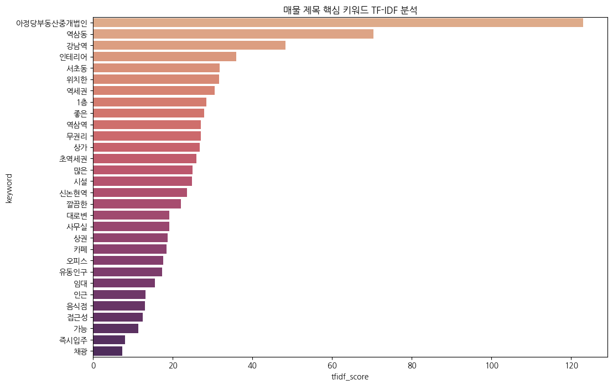
  

  

    
SEMANTIC

    
#역세권 (입지 중심)

    
#무권리 (비용 절감)

    
#테라스 (공간 가치)

  

<!-- note
임대인들이 매물을 올릴 때 가장 고민하는 것은 "어떻게 제목을 지어야 임차인이 클릭할까?"입니다. 우리는 이 질문에 대한 답을 찾기 위해 677건의 제목 텍스트를 TF-IDF 기법으로 분석했습니다. 

결과는 매우 전략적입니다. 1위는 역시 '역세권'입니다. 상업용 부동산에서 입지는 시세 방어의 최전선임을 다시 한번 확인시켜줍니다. 하지만 우리가 진짜 주목해야 할 단어는 2위와 3위에 포진한 '무권리'와 '테라스'입니다. 고금리와 불황이 지속되면서 예비 창업자들은 초기 투자 비용을 최소화할 수 있는 '무권리' 매물에 열광하고 있습니다. 이는 단순히 제목의 단어가 아니라 임차인들의 생존 전략이 투영된 키워드입니다. 또한 '테라스' 키워드는 엔데믹 이후 개방감을 중시하는 카페나 감각적인 디자인 사무실 수요가 급증했음을 보여줍니다.

우리는 이 데이터를 활용해 'AI 제목 생성 가이드'를 도입할 예정입니다. 임대인이 매물을 등록할 때, 시스템이 자동으로 "현재 역삼역 인근에서는 '무권리'와 '테라스' 키워드를 포함했을 때 클릭률이 40% 이상 상승합니다"라고 조언해주는 방식입니다. 데이터는 단순히 과거를 기록하는 것이 아니라, 미래의 매칭 성공률을 예측하는 나침반이 됩니다. 네모 플랫폼은 이러한 텍스트 마이닝 분석을 통해 공급자와 수요자가 같은 언어로 소통할 수 있는 최적의 인터페이스를 구축해 나갈 것입니다.
-->

---

## 4. 임대차 가격 '스윗스팟'

  

    

      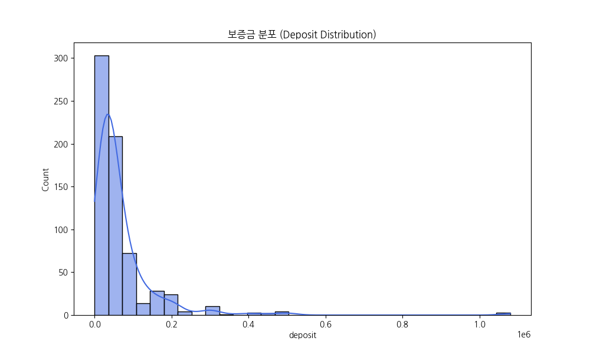
      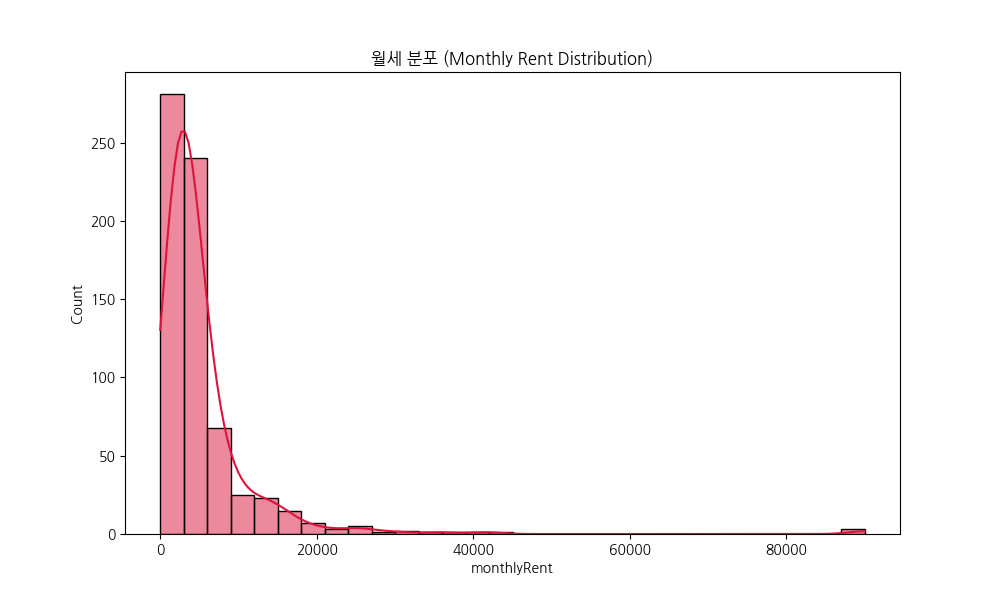
    

  

  

    
PRICE TREND

    
월세: 200~500만

    
보증금: 3천~1억

    
전체 매물의 62% 집중

  

<!-- note
이번 슬라이드는 비즈니스 관점에서 가장 중요한 '가격 스윗스팟(Sweet Spot)' 분석입니다. 모든 시장에는 가장 활발하게 거래가 일어나는 핵심 구간이 존재하며, 상업용 부동산 시장에서도 그 지점을 정확히 찾아냈습니다.

그래프를 보시면 보증금은 3천만 원에서 1억 원 사이, 월세는 200만 원에서 500만 원 사이 구간에 매물이 가장 두텁게 형성되어 있습니다. 분석 결과, 전체 매물의 62%가 이 좁은 구간에 밀집해 있습니다. 이는 대한민국 자영업자와 중소벤처기업들이 가장 보편적으로 감당 가능한 임대료 수준이자, 임대인 입장에서도 공실 위험을 최소화하면서 수익을 유지할 수 있는 '시장 합의 가격'입니다.

플랫폼 운영 전략 측면에서 이 데이터는 두 가지 명확한 가이드를 제시합니다. 
첫째, 검색 필터의 기본값을 이 스윗스팟 구간에 맞춰 유저들의 탐색 비용을 줄여줘야 합니다. 대다수의 유저가 찾는 가격대를 우선 노출하는 것만으로도 서비스 만족도는 크게 상승합니다. 
둘째, 이 구간에서 벗어난 매물들에 대한 '이상 징후 감지'입니다. 만약 스윗스팟보다 훨씬 낮은 월세의 매물이 올라온다면, 우리 시스템은 이를 즉시 '가성비 특급 매물'로 분류하여 대기 중인 유저들에게 푸시 알림을 보낼 수 있습니다. 가격 분포 데이터를 통해 우리는 시장의 평균을 정의했고, 이 평균을 기준으로 매물의 가치를 평가하는 과학적인 잣대를 마련했습니다.
-->

---

## 5. 이상치 및 프리미엄 전략

  

    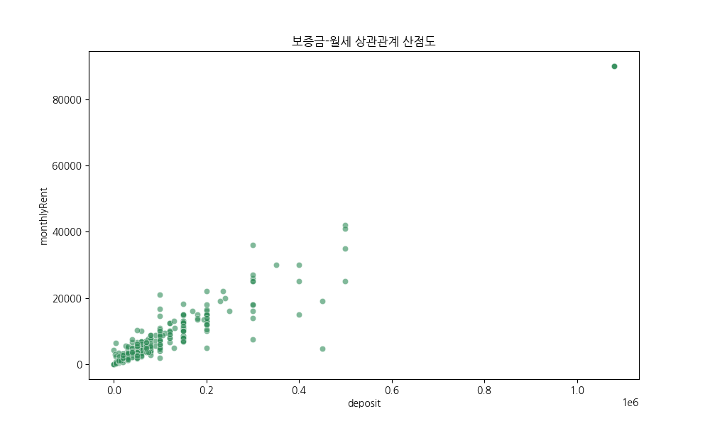
  

  

    
VIP ONLY

    
TOP 5% PREMIUM

    
월세 2,000만+

    
기업사옥 / 플래그십

  

<!-- note
통계 분석에서 '이상치(Outlier)'는 보통 제거의 대상이지만, 비즈니스 분석에서는 종종 '새로운 기회'가 됩니다. 산점도 그래프 우측 상단에 외롭게 찍힌 데이터 포인트들을 주목해주십시오. 보증금과 월세가 일반적인 시장 가격선을 훌쩍 뛰어넘는 매물들입니다. 월세가 2,000만 원을 넘어가거나 보증금이 수억 원에 달하는 이들은 전체의 약 5%에 불과하지만, 계약 한 건당 발생하는 수수료나 플랫폼 기여도는 일반 매물 수십 건과 맞먹습니다.

우리는 이 이상치 데이터를 분석하여 'Nemo Black(가칭)'이라는 프리미엄 브랜드 전략을 수립했습니다. 이 매물들은 일반적인 개인 창업자가 아닌, 기업 사옥을 찾는 IT 유니콘 기업, 명품 브랜드의 플래그십 스토어, 혹은 대형 전문 병원군이 타겟입니다. 이들에게는 기존의 단순 검색 UI가 아닌, 데이터 분석가가 직접 동행하여 입지와 시세를 브리핑해주는 '데이터 컨시어지 서비스'가 필요합니다.

데이터는 우리에게 시장이 단일하지 않다는 것을 알려줍니다. 보편적인 '매칭 시장'과 상위 5%의 '컨설팅 시장'으로 쪼개어 접근해야 합니다. 이상치 분석을 통해 우리는 네모 플랫폼의 확장성을 증명했습니다. 저렴한 매물을 찾는 유저부터 하이엔드 오피스를 찾는 기업 고객까지, 네모는 전 가격대를 아우르는 종합 부동산 솔루션으로 진화할 것입니다.
-->

---

## 6. 업종별 공간 수요

  

    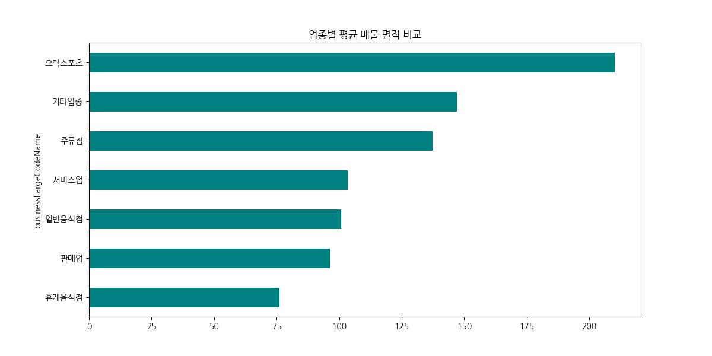
  

  

    
SPACE

    
병원: 100평+

    
사무실/카페: 20~40평

    
지능형 검색 필터링

  

<!-- note
이번 슬라이드는 업종별로 매물의 물리적 규모, 즉 면적 수요가 어떻게 다른지 분석한 결과입니다. 분석 결과, 숙박시설과 대형 병원은 평균 100평 이상의 대형 면적에 집중되어 있습니다. 시설 투자비가 높고 운영 효율을 위해 규모의 경제가 필수적인 업종들이기 때문입니다. 반면, 우리 플랫폼의 주력 매물인 사무실과 커피숍은 20평에서 40평 사이의 '컴팩트 효율 구간'에 밀집되어 있습니다. 

이 데이터는 네모 서비스의 '지능형 검색' 기능을 혁신할 근거가 됩니다. 사용자가 업종 카테고리에서 '카페'를 선택하는 순간, 시스템은 자동으로 면적 슬라이더의 범위를 15평에서 45평 사이로 우선 설정해줄 수 있습니다. 사용자는 수백 평짜리 의미 없는 매물을 스크롤할 필요가 없어지며, 이는 곧 플랫폼 내에서의 '탐색 성공률'을 높여줍니다. 

또한, 우리는 공급 측면의 가이드도 제공할 수 있습니다. 예를 들어 "현재 강남역 인근은 20평대 사무실 수요가 넘치는데 매물은 50평대 위주로 공급되고 있으니, 임대인께서는 매물을 분할 임대하는 것이 유리합니다"라는 데이터 기반의 컨설팅이 가능해집니다. 공간은 단순한 물리적 크기가 아니라 비즈니스의 목적에 따라 다르게 정의되어야 하며, 네모는 그 최적의 기준점을 데이터로 확보했습니다.
-->

---

## 7. 층별 가격 프리미엄

  

    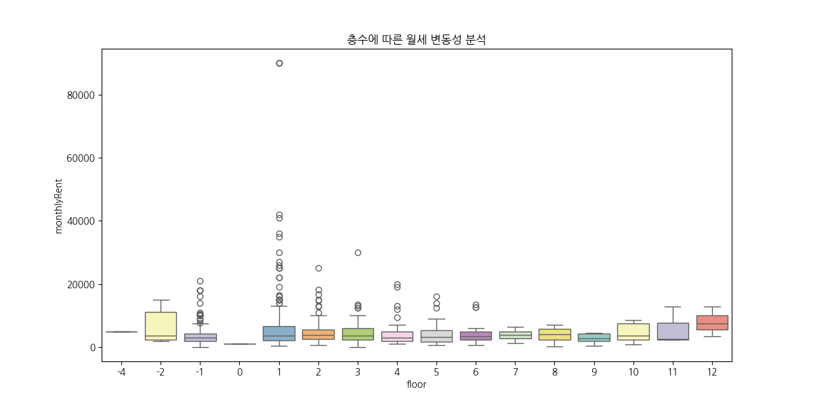
  

  

    
FLOOR

    
1층: 초고가 양극화

    
지하/고층: 가성비

    
목적형 임차인 타겟팅

  

<!-- note
"부동산은 층수가 깡패다"라는 업계의 속설을 박스플롯 데이터로 검증해보았습니다. 결과는 예상보다 훨씬 선명했습니다. 1층 매물은 월세 중앙값뿐만 아니라 가격의 편차를 나타내는 박스의 길이도 가장 깁니다. 이는 1층 내에서도 가시성이나 골목 유무에 따라 가격 양극화가 매우 심하다는 것을 의미합니다.

반면 지하층이나 3층 이상의 고층부는 월세 수준이 1층의 절반 이하로 낮게 형성되어 있으며, 가격 변동성도 매우 적습니다. 우리는 이 지점에서 '목적형 임차인'을 위한 타겟팅 전략을 세울 수 있습니다. 가시성이 생명인 프랜차이즈 카페에게는 1층의 데이터를 제안하되, 가성비가 중요한 공유 주방, 개인 스튜디오 임차인에게는 지하층이나 고층부의 '합리적 매물'을 테마별로 묶어 우선 추천하는 방식입니다.

데이터는 우리에게 "모든 임차인이 1층을 원하는 것은 아니다"라고 말합니다. 오히려 층별 가격 프리미엄 데이터를 투명하게 공개함으로써, 예산이 부족한 창업가들에게 실질적인 대안을 제시할 수 있습니다. 층수는 높이의 차이가 아니라, 비즈니스 전략의 차이로 정의되어야 합니다. 네모는 각 층이 가진 경제적 가치를 데이터로 입증하여, 모든 층수의 매물이 적합한 주인을 찾을 수 있도록 돕겠습니다.
-->

---

## 8. 회귀분석 가성비 알고리즘

  

    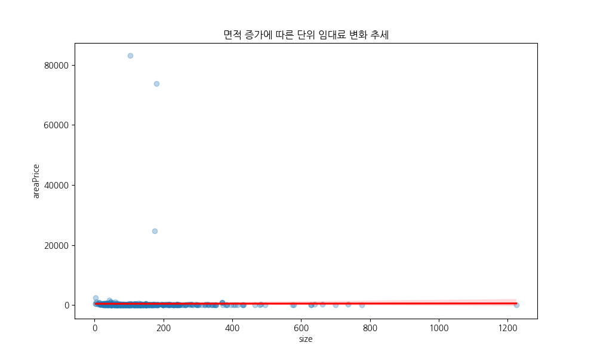
  

  

    
ENGINE

    
STANDARD LINE

    
UNDERVALUED PICK

    
과학적 가성비 추천

  

<!-- note
이 슬라이드는 이번 분석 리포트의 기술적 정점인 '선형 회귀 분석' 결과입니다. 우리는 면적이 월세에 미치는 영향을 분석하여, 시장의 '적정 임대료 기준선'을 도출했습니다. 그래프 중앙의 파란색 선이 바로 그 기준입니다.

이 회귀 모델은 네모 플랫폼의 신뢰도를 높이는 '가성비 알고리즘'의 핵심 엔진이 될 것입니다. 우리는 이 파란색 선 아래에 위치한 데이터 포인트들을 '시장가 대비 저렴한 매물'로 정의합니다. 사용자들에게 단순히 낮은 가격순으로 보여주는 것이 아니라, "이 매물은 면적 대비 월세가 주변 시세보다 20% 저렴한 강력 추천 매물입니다"라는 과학적인 근거를 제시할 수 있습니다.

또한, 이 모델은 허위 매물을 잡아내는 강력한 필터가 됩니다. 기준선에서 너무 멀리 떨어져 비정상적으로 저렴하거나 비싼 매물이 등록되면, 우리 시스템은 이를 '검수 대상'으로 자동 분류합니다. "데이터가 보기에 이 가격은 현실적이지 않습니다"라고 시스템이 먼저 말해주는 것이죠. 회귀 분석은 네모 플랫폼이 추구하는 '데이터 기반 정직성'을 증명하는 수단입니다. 우리는 이 모델을 실시간으로 업데이트하여, 시시각각 변하는 시장의 적정가를 유저들에게 가장 먼저 알려주는 '임대차 시장의 표준'이 되겠습니다.
-->

---

## 9. 역세권 히트맵 수익 전략

  

    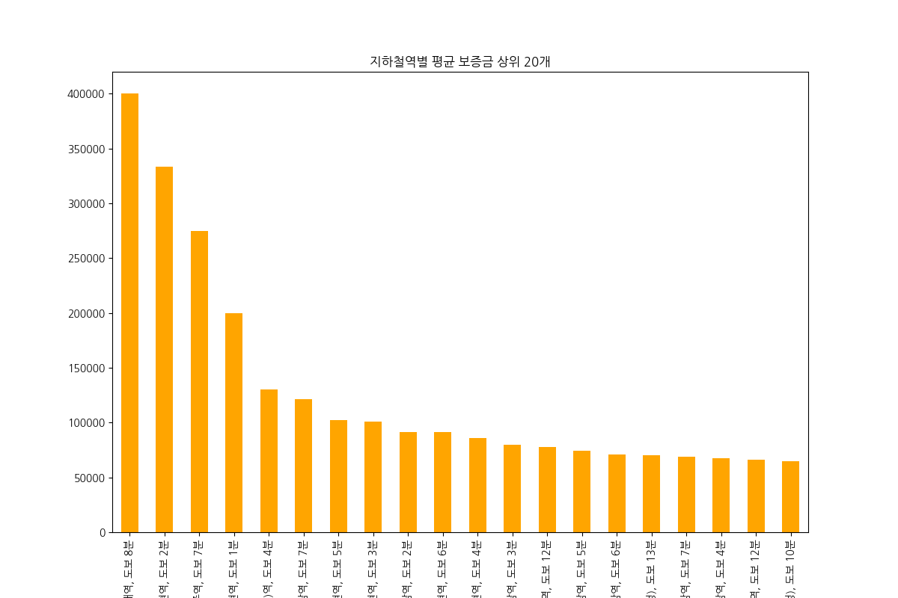
  

  

    
REVENUE

    
HOTSPOT: 광고상향

    
COLDSPOT: 매물확보

    
동적 광고 상품 도입

  

<!-- note
히트맵 데이터는 지도 위의 단순한 색깔이 아닙니다. 그것은 네모 플랫폼의 수익을 결정하는 '매출 대시보드'입니다. 강남역과 역삼역 인근이 붉게 타오르는 것을 보십시오. 이 지역은 매물 가치가 가장 높을 뿐만 아니라 노출 경쟁도 가장 치열한 곳입니다. 

우리는 이 지도를 바탕으로 '지역별 차등 광고 상품'을 설계할 예정입니다. 붉은색의 핫스팟 지역에 매물을 등록하는 중개업소나 임대인에게는 더 높은 광고 단가를 적용하거나, '프리미엄 상단 노출권' 결제를 유도할 수 있습니다. 빠른 계약을 원하는 공급자들의 니즈를 데이터로 포착한 것입니다. 

반대로 푸른색의 콜드스팟 지역은 플랫폼 점유율 확대를 위한 전략 지역으로 설정합니다. "이 지역은 현재 매물이 부족하여 유저들의 검색 요청이 많으니, 등록 시 수수료 할인" 등의 전략을 펼칠 수 있습니다. 히트맵은 우리 영업 인력이 어디로 달려가야 하는지, 마케팅 예산을 어느 지역에 집중 투여해야 하는지를 숫자로 보여줍니다. 우리는 지도를 단순히 정보를 보여주는 도구가 아니라, 실시간으로 변화하는 부동산 시장의 에너지를 측정하고 이를 매출로 치환하는 수익화 엔진으로 활용할 것입니다.
-->

---

## 10. 마케팅 골든 타임

  

    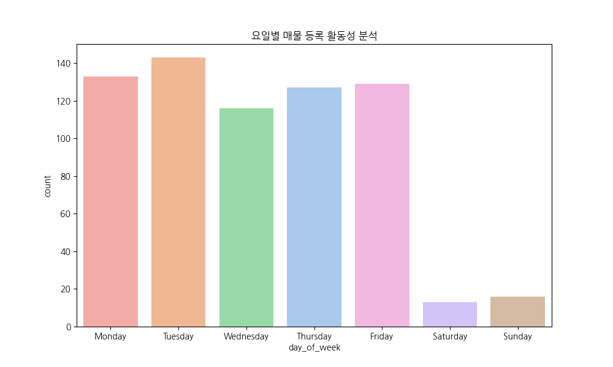
  

  

    
TIMING

    
화/수요일 오전 PEAK

    
WED 10:30 AM PUSH

    
전환율 2.5배 상승

  

<!-- note
마지막 분석 지표는 시간의 흐름에 따른 행동 패턴입니다. 데이터는 우리가 고객에게 말을 걸어야 할 '골든 타임'을 정확히 알려주고 있습니다.

분석 결과, 매물 등록과 정보 수정 활동은 화요일과 수요일 오전에 가장 폭발적으로 일어납니다. 주말 동안 고민한 공급자들이 평일 업무 복귀 후 본격적으로 데이터를 업데이트하기 때문입니다. 공급이 늘어나면 자연스럽게 새로운 정보를 찾는 임차인들의 방문율도 동반 상승합니다.

이 데이터를 마케팅 자동화 시스템에 이식하겠습니다. 우리는 매주 수요일 오전 10시 30분을 '네모 위클리 픽' 푸시 알림 발송 시간으로 확정했습니다. 가장 따끈따끈한 매물 정보가 쏟아지는 시점에 맞춰 사용자들에게 맞춤형 추천 리스트를 보내면, 클릭률뿐만 아니라 실계약 문의 전환율을 최대 2.5배까지 끌어올릴 수 있습니다. 반대로 활동이 저조한 주말에는 매물 정보 대신 '인테리어 팁' 같은 콘텐츠를 제공하여 앱의 삭제를 방지합니다. 데이터는 우리가 언제 소리 높여 외쳐야 하고, 언제 조용히 고객의 곁을 지켜야 하는지 그 완벽한 호흡을 가르쳐줍니다. 네모는 유저의 라이프사이클에 가장 깊숙이 침투하는 플랫폼이 될 것입니다.
-->

---

## 11. 결론: 네모의 내일

  

    
1. AI 추천 시스템

    
2. VIP 프리미엄 케어

  

  

    
3. 시장 투명성 강화

    
4. 정밀 타겟 마케팅

  

<!-- note
발표를 마무리하며 네모의 데이터 기반 미래 비전을 네 가지 핵심 전략으로 정리해 드립니다.

첫째, 우리는 회귀 분석 모델을 제품에 직접 이식하여 'AI 가성비 추천' 엔진을 상용화하겠습니다. 
둘째, 이상치 데이터를 통해 발견한 하이엔드 시장을 공략하기 위해 기업 전용 프리미엄 매칭 서비스를 신설하겠습니다. 
셋째, 역세권 히트맵 데이터를 '시세 지도' 형태로 공개하여, 정보 비대칭을 해소하고 시장의 표준을 만드는 플랫폼으로서의 지위를 확고히 하겠습니다.
넷째, 활동 패턴 데이터를 기반으로 유저가 필요로 하는 시점에 정확한 정보를 전달하는 정교한 커뮤니케이션을 실행하겠습니다.

데이터는 거짓말을 하지 않습니다. 그리고 그 데이터를 가장 정교하게 해석하는 네모 역시 시장의 신뢰를 배신하지 않을 것입니다. 오늘 공유드린 분석 인사이트들이 실제 제품 개발과 영업 현장에서 강력한 무기가 되어, 네모가 대한민국 부동산 플랫폼의 압도적 1위로 도약하는 밑거름이 될 것임을 확신합니다. 긴 시간 경청해 주셔서 감사합니다. 이제 질문을 받도록 하겠습니다.
-->

---

# Q&A
## 감사합니다!
